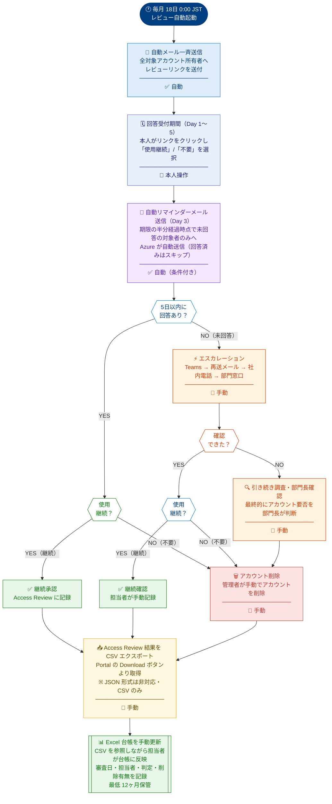

# 🔐 Azure Access Review 自動化支援ソリューション
**ユースケース・運用ルール・ワークフロー**

> 社外秘 ｜ 管理層向け資料  
> 実施サイクル：毎月18日 ／ レビュー期間：5日間 ／ 方式：セルフレビュー ／ 対象：全社アカウント

---

## 01 ｜ ユースケース — 背景・課題とソリューション概要

社内アカウントの棚卸し業務は、これまで **Excel による手動管理** で実施されてきました。
この手法には多くの非効率・リスクが存在しており、**Azure Access Review を活用した自動化支援** への移行を提案します。

> ⚠️ **本ソリューションについて**  
> Azure Access Review により通知・収集フェーズを自動化しますが、**CSVエクスポート後の内容確認・Excel台帳への反映・アカウント削除判断は引き続き手動で実施**します。完全自動化ではなく、管理工数の削減と証跡の標準化を目的とした **半自動化（自動化支援）** ソリューションです。

### 現状の課題（Excel 管理）

| # | 課題 |
|---|------|
| 1 | 手作業による入力ミス・漏れのリスク |
| 2 | 担当者への個別連絡に多大な工数 |
| 3 | 棚卸し結果の証跡・ログ管理が困難 |
| 4 | 不要アカウントの放置によるセキュリティリスク |
| 5 | 管理者への負担集中、スケーラビリティ不足 |

### Azure Access Review による解決

| # | 解決策 |
|---|--------|
| 1 | 自動メール送信でセルフレビューを実現 |
| 2 | Access Review 結果の CSV エクスポートにより証跡を標準化 |
| 3 | 未対応者への多段階エスカレーション（通知フェーズを自動化） |
| 4 | CSV を基に担当者が手動確認・Excel 台帳を更新し、不要アカウントを削除 |
| 5 | 管理工数の削減とガバナンス・透明性の強化 |

### 主要ベネフィット

| アイコン | 項目 | 内容 |
|----------|------|------|
| ⏱️ | 工数削減 | 通知・収集工数を自動化し棚卸し作業時間を大幅削減 |
| 🛡️ | セキュリティ強化 | 不要アカウントの定期的な検出・削除 |
| 📋 | 監査対応 | CSV エクスポートにより証跡を標準形式で保全 |
| 📱 | 多チャネル対応 | メール・Teams・電話で確認を徹底 |
| 🔄 | 定期自動実施 | 毎月同一ルールで一貫性を確保 |
| 📊 | 可視化・レポート | アカウント状況を CSV で定期的に記録・把握 |

---

## 02 ｜ 運用ルール — アクセスレビュー 運用ルール一覧

本ソリューションは以下のルールに基づき運用します。
自動フェーズと手動フェーズを明確に区分し、標準化された手順で実施します。

| ルール項目 | 設定値 | 詳細・備考 | 分類 |
|------------|--------|------------|------|
| **実施日** | 毎月 **18日** | Azure Access Review にて毎月18日 0:00 JST に自動起動。レビュー期間は5日間（自然日）。 | `スケジュール` |
| **レビュー方式** | セルフレビュー | 対象アカウント所有者本人に確認メールを自動送信。本人がリンクをクリックし「継続使用」または「不要」を選択する。 | `方式` |
| **初回通知** | 18日 自動送信 | Azure から対象ユーザー全員へ確認メールを一斉送信。メール本文にはレビューリンクを記載。 | `自動` |
| **自動リマインダー** | 期間の半分経過時点（Day 3・自動） | レビュー期間5日中、期限の半分（3日）を経過しても未回答の対象者に対し、Azure が自動的にリマインダーメールを送信。回答済みの対象者には送信されない。 | `自動（条件付き）` |
| **回答期限** | 5日以内（23日まで） | 初回送信から5日以内（23日末日）に回答がない場合、エスカレーションフローに移行。 | `期限` |
| **エスカレーション手段** | 多チャネル対応 | ① Microsoft Teams メッセージ ② 再送メール ③ 社内電話 ④ 部門連絡窓口 — の順で手動確認を実施。 | `手動` |
| **結果エクスポート** | レビュー完了後・手動取得 | Access Review の「Download」ボタンより審査結果を **CSV 形式**でエクスポート。Excel 等で開き内容を確認する。※ JSON 形式は Access Review では非対応。 | `手動・CSV` |
| **Excel 台帳の更新** | CSV 確認後・手動 | エクスポートした CSV を基に担当者がアカウントの要否を確認し、**Excel 台帳に手動で反映**する。台帳には審査日・担当者・判定結果・削除有無を記録。 | `手動` |
| **アカウント削除** | 台帳確認後・手動実施 | 「不要」と判定されたアカウントを管理者が手動で削除。削除記録（日付・申請者・承認者）を Excel 台帳に登録する。 | `手動` |
| **証跡保管期間** | 最低 12ヶ月 | 監査・コンプライアンス対応のため、CSV エクスポートファイルおよび Excel 台帳は最低12ヶ月間保管する。 | `コンプライアンス` |

### 自動 / 手動 フェーズ区分

| フェーズ | 担当 | 自動 / 手動 |
|----------|------|------------|
| レビュー起動・メール送信 | Azure システム | ✅ 自動 |
| リマインダーメール送信（未回答者のみ） | Azure システム | ✅ 自動（条件付き） |
| セルフレビュー回答 | 対象者本人 | 👤 本人操作 |
| 期限超過後のエスカレーション連絡 | 管理者・IT担当 | 🔧 手動 |
| 結果 CSV エクスポート | 管理者 | 🔧 手動 |
| CSV 確認・Excel 台帳更新 | 管理者 | 🔧 手動 |
| アカウント削除・台帳登記 | 管理者 | 🔧 手動 |

### 通知・エスカレーション フロー

| ステップ | タイミング | 手段 | 担当 | 内容 |
|----------|-----------|------|------|------|
| **Step 1** | Day 0（18日）| 📧 初回メール | 自動 | レビュー開始と同時に全対象者へ確認メールを自動送信 |
| **Step 2** | Day 3（中間）| 🔔 リマインダーメール | **自動（条件付き）** | 期間の半分経過時点で未回答の対象者のみへ Azure が自動送信。回答済みはスキップ。 |
| **Step 3** | Day 5 超過後 | 💬 Microsoft Teams | 手動 | 管理者が DM で確認依頼を送付 |
| **Step 4** | Step 3 後も未回答 | 📨 メール再送 | 手動 | 管理者より再度メールにて催促 |
| **Step 5** | Step 4 後も未回答 | 📞 社内電話 | 手動 | 社内電話番号に直接連絡し口頭で確認 |
| **Step 6** | 最終手段 | 🏢 部門連絡窓口 | 手動 | 部門担当窓口・上長に代理確認を依頼し、台帳へ記録 |

---

## 03 ｜ ワークフロー — 月次アクセスレビュー

### 📅 実施タイムライン

```
Day 0        Day 1〜2      Day 3         Day 4〜5      Day 6〜        月末
（18日）                  （中間）       （23日）
  │            │             │              │             │             │
  ▼            ▼             ▼              ▼             ▼             ▼
🚀 レビュー  📬 回答受付   🔔 自動        ⏳ 残り        📞 エスカ     📥 CSV出力
   開始         期間          リマインダー    回答期間        レーション      ↓
   メール送信   ログ蓄積      （未回答者のみ） 期限到来        多チャネル    🔧 台帳更新
                                                                          削除・登記
```

### 📐 詳細フロー図



### 📝 フロー補足説明

| フェーズ | 担当 | 区分 | 実施内容 | 出力 |
|----------|------|------|----------|------|
| レビュー開始・メール送信 | Azure システム | ✅ 自動 | 毎月18日に Access Review ジョブを起動、メールを全対象者へ一斉送信 | 送信ログ |
| セルフレビュー回答 | 対象者本人 | 👤 本人操作 | リンクより「使用継続」または「不要」を選択。5日間受付。 | 回答データ |
| リマインダーメール | Azure システム | ✅ 自動（条件付き） | Day 3 経過時点で未回答の対象者のみへ自動送信。回答済み者はスキップ。 | 送信ログ |
| エスカレーション | 管理者・IT担当 | 🔧 手動 | 5日超過後、Teams → 再送メール → 電話 → 部門窓口の順で対応 | 確認記録 |
| CSV エクスポート | 管理者 | 🔧 手動 | Access Review Portal より Download ボタンで結果を CSV 取得。**JSON 形式は非対応。** | CSV ファイル |
| Excel 台帳更新 | 管理者 | 🔧 手動 | CSV の内容を確認しながら Excel 台帳に審査結果・削除有無を手動で反映 | Excel 台帳 |
| アカウント削除・登記 | 管理者 | 🔧 手動 | 不要確認されたアカウントを手動で削除し、削除日・申請者・承認者を Excel 台帳に記録 | Excel 台帳（更新） |

---

## 04 ｜ まとめ — 期待効果と推奨事項

本ソリューションの導入により、セキュリティ・コンプライアンス・運用効率の三軸で改善が見込まれます。
通知・収集フェーズを自動化することで管理負担を軽減しつつ、判断・削除・台帳更新は引き続き人的確認を伴う **信頼性の高い半自動化プロセス** を実現します。

| アイコン | 項目 | 期待効果 |
|----------|------|----------|
| 💰 | 工数削減 | 通知・収集の自動化により手動連絡工数を大幅削減 |
| 🔒 | リスク低減 | 不要アカウントの定期的な棚卸しによる不正アクセス防止 |
| 📑 | 監査対応 | CSV + Excel 台帳による標準化された証跡管理 |
| ⚙️ | 標準化 | 属人化排除・毎月同一手順で一貫した品質を維持 |
| 📈 | スケーラビリティ | 組織拡大に対応し自動通知で対象者増加にも対処可能 |
| 🤝 | ガバナンス強化 | 判断責任の明確化と透明性のある削除プロセスを確立 |

---

*社外秘 ｜ このドキュメントは管理層向けに作成されたものです ｜ Azure Access Review 自動化支援プロジェクト*  
*参考：[Microsoft Learn - Complete an access review](https://learn.microsoft.com/en-us/entra/id-governance/complete-access-review) ｜ [Access review history report](https://learn.microsoft.com/en-us/entra/id-governance/access-reviews-downloadable-review-history)*
