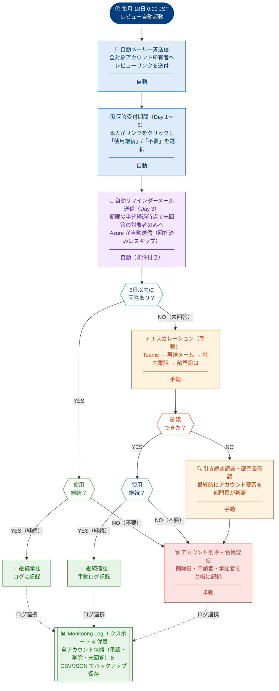

# 🔐 Azure Access Review 自動化ソリューション
**ユースケース・運用ルール・ワークフロー**

> 社外秘 ｜ 管理層向け資料  
> 実施サイクル：毎月18日 ／ レビュー期間：5日間 ／ 方式：セルフレビュー ／ 対象：全社アカウント

---

## 01 ｜ ユースケース — 背景・課題とソリューション概要

社内アカウントの棚卸し業務は、これまで **Excel による手動管理** で実施されてきました。
この手法には多くの非効率・リスクが存在しており、**Azure Access Review を活用した自動化** への移行を提案します。

### 現状の課題（Excel 管理）

| # | 課題 |
|---|------|
| 1 | 手作業による入力ミス・漏れのリスク |
| 2 | 担当者への個別連絡に多大な工数 |
| 3 | 棚卸し結果の証跡・ログ管理が困難 |
| 4 | 不要アカウントの放置によるセキュリティリスク |
| 5 | 管理者への負担集中、スケーラビリティ不足 |

### Azure Access Review による解決

| # | 解決策 |
|---|--------|
| 1 | 自動メール送信でセルフレビューを実現 |
| 2 | Monitoring Log による自動証跡・バックアップ |
| 3 | 未対応者への多段階エスカレーション自動化 |
| 4 | 不要アカウントの速やかな削除・登記 |
| 5 | 管理工数の大幅削減とガバナンス強化 |

### 主要ベネフィット

| アイコン | 項目 | 内容 |
|----------|------|------|
| ⏱️ | 工数削減 | 棚卸し作業時間を最大 80% 削減 |
| 🛡️ | セキュリティ強化 | 不要アカウントの即時検出・削除 |
| 📋 | 監査対応 | ログ自動取得により証跡を完全保全 |
| 📱 | 多チャネル対応 | メール・Teams・電話で確認を徹底 |
| 🔄 | 定期自動実施 | 毎月同一ルールで一貫性を確保 |
| 📊 | 可視化・レポート | アカウント状況をリアルタイム把握 |

---

## 02 ｜ 運用ルール — アクセスレビュー 運用ルール一覧

本ソリューションは以下のルールに基づき、毎月自動実行されます。
各ルールは標準化・文書化されており、担当者が変わっても同一品質を維持します。

| ルール項目 | 設定値 | 詳細・備考 | 分類 |
|------------|--------|------------|------|
| **実施日** | 毎月 **18日** | Azure Access Review にて毎月18日 0:00 JST に自動起動。レビュー期間は5日間。 | `スケジュール` |
| **レビュー方式** | セルフレビュー | 対象アカウント所有者本人に確認メールを自動送信。本人がリンクをクリックし「継続使用」または「不要」を選択する。 | `方式` |
| **初回通知** | 18日 自動送信 | Azure から対象ユーザー全員へ確認メールを一斉送信。メール本文にはレビューリンクを記載。 | `自動通知` |
| **自動リマインダー** | 期間の半分経過時点（自動） | レビュー期間5日中、期限の半分（3日）を経過しても未回答の対象者に対し、Azure が自動的にリマインダーメールを送信。回答済みの対象者には送信されない。 | `自動通知` |
| **回答期限** | 5日以内（23日まで） | 初回送信から5日以内（23日末日）に回答がない場合、エスカレーションフローに移行。 | `期限` |
| **エスカレーション手段** | 多チャネル対応 | ① Microsoft Teams メッセージ ② 再送メール ③ 社内電話 ④ 部門連絡窓口 — の順で手動確認を実施。 | `エスカレーション` |
| **Monitoring Log** | 毎月自動取得 | レビュー期間終了後、Azure Monitoring Log からアカウント状態（承認・未回答・拒否）を CSV/JSON でエクスポートし、セキュアストレージに保存。 | `ログ管理` |
| **アカウント削除** | 即時削除 + 登記 | 「不要」と確認されたアカウントは速やかに削除し、削除記録（日付・申請者・承認者）を台帳に登録。 | `削除処理` |
| **証跡保管期間** | 最低 12ヶ月 | 監査・コンプライアンス対応のため、Monitoring Log および削除台帳は最低12ヶ月間保管する。 | `コンプライアンス` |

### 通知・エスカレーション フロー

| ステップ | タイミング | 手段 | 担当 | 内容 |
|----------|-----------|------|------|------|
| **Step 1** | Day 0（18日）| 📧 初回メール | 自動 | レビュー開始と同時に全対象者へ確認メールを自動送信 |
| **Step 2** | Day 3（中間）| 🔔 リマインダーメール | **自動（条件付き）** | 期間の半分経過時点で未回答の対象者のみへ Azure が自動送信。回答済みはスキップ。 |
| **Step 3** | Day 5 超過後 | 💬 Microsoft Teams | 手動 | 管理者が DM で確認依頼を送付 |
| **Step 4** | Step 3 後も未回答 | 📨 メール再送 | 手動 | 管理者より再度メールにて催促 |
| **Step 5** | Step 4 後も未回答 | 📞 社内電話 | 手動 | 社内電話番号に直接連絡し口頭で確認 |
| **Step 6** | 最終手段 | 🏢 部門連絡窓口 | 手動 | 部門担当窓口・上長に代理確認を依頼し、台帳へ記録 |

---

## 03 ｜ ワークフロー — 月次アクセスレビュー

### 📅 実施タイムライン

```
Day 0        Day 1〜2      Day 3         Day 4〜5      Day 6〜        月末
（18日）                  （中間）       （23日）
  │            │             │              │             │             │
  ▼            ▼             ▼              ▼             ▼             ▼
🚀 レビュー  📬 回答受付   🔔 自動        ⏳ 残り        📞 エスカ     ✅ ログ出力
   開始         期間          リマインダー    回答期間        レーション      削除・登記
   メール送信   ログ蓄積      （未回答者のみ） 期限到来        多チャネル
```

### 📐 詳細フロー図



### 📝 フロー補足説明

| フェーズ | 担当 | 実施内容 | 出力 |
|----------|------|----------|------|
| `自動` レビュー開始 | Azure システム | 毎月18日に Access Review ジョブを起動、メールを全対象者へ送信 | 送信ログ |
| `自動` 回答受付 | 対象者本人 | リンクより「使用継続」または「不要」を選択。5日間受付。 | 回答データ |
| `自動（条件付）` リマインダー | Azure システム | Day 3 経過時点で未回答の対象者のみへ自動でリマインダーメールを送信。回答済み者はスキップ。 | 送信ログ |
| `手動` エスカレーション | 管理者・IT担当 | 5日超過後、Teams → 再送メール → 電話 → 部門窓口の順で対応 | 確認記録 |
| `手動` 削除・登記 | 管理者 | 不要確認されたアカウントを即時削除し、台帳に登録 | 削除台帳 |
| `自動` ログ保管 | Azure システム | Monitoring Log より全アカウント状態をエクスポートし、セキュアストレージへ保存 | CSV / JSON ファイル |

---

## 04 ｜ まとめ — 期待効果と推奨事項

本ソリューションの導入により、セキュリティ・コンプライアンス・運用効率の三軸で大幅な改善が見込まれます。
経営層としての承認・推進のご支援をお願いいたします。

| アイコン | 項目 | 期待効果 |
|----------|------|----------|
| 💰 | コスト削減 | 手動棚卸し工数・エラー対応コスト削減 |
| 🔒 | リスク低減 | 不要アカウントによる不正アクセス防止 |
| 📑 | 監査対応 | 完全な証跡でコンプライアンス確保 |
| ⚙️ | 標準化 | 属人化排除・一貫したプロセス |
| 📈 | スケーラビリティ | 組織拡大に対応し自動で拡張 |
| 🤝 | ガバナンス強化 | 責任の明確化と透明性の確保 |

---

*社外秘 ｜ このドキュメントは管理層向けに作成されたものです ｜ Azure Access Review 自動化プロジェクト*
